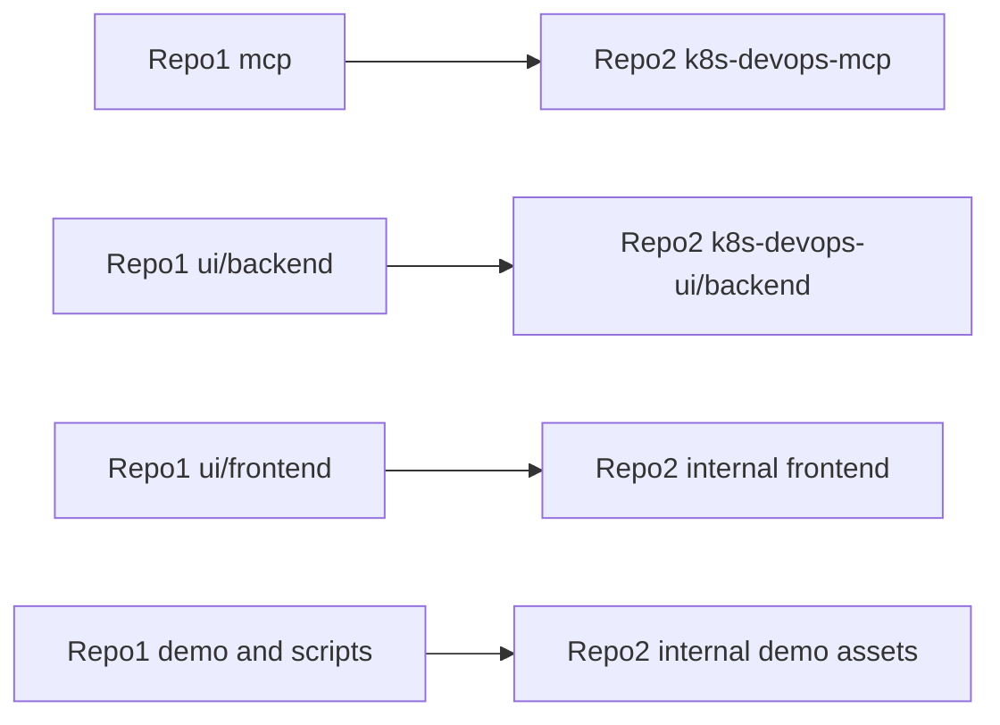

# Port Repo 1 Features Into Repo 2

## Goal

Bring repo 1's newer features into repo 2 without turning repo 2 into the public/open-source layout. Repo 2 should keep its internal naming, Symbotic visual system, ProGet/GKE/Jenkins deployment configuration, and existing UI improvements such as example prompts, edit/resend, copy actions, dual health indicators, and the richer SSH panel.

## Migration Shape

## Phase 1: Server-Side Feature Parity

Port the backend/MCP capabilities that repo 1 has and repo 2 lacks:

- Add repo 1's pluggable LLM provider package from [`/Users/pruthvidavineni/source/repos/k8s-devops-ai-assistant/mcp/services/llm`](file:///Users/pruthvidavineni/source/repos/k8s-devops-ai-assistant/mcp/services/llm) into [`/Users/pruthvidavineni/AI_DevOps_Assistant/k8s-devops-ai-assistant/k8s-devops-mcp/services`](file:///Users/pruthvidavineni/AI_DevOps_Assistant/k8s-devops-ai-assistant/k8s-devops-mcp/services).
- Update repo 2's [`k8s-devops-mcp/services/llm_service.py`](file:///Users/pruthvidavineni/AI_DevOps_Assistant/k8s-devops-ai-assistant/k8s-devops-mcp/services/llm_service.py) to use the provider abstraction while preserving internal Gemini defaults.
- Extend repo 2's [`k8s-devops-mcp/config/settings.py`](file:///Users/pruthvidavineni/AI_DevOps_Assistant/k8s-devops-ai-assistant/k8s-devops-mcp/config/settings.py) with repo 1 settings such as `LLM_PROVIDER`, Ollama URL/model, and provider-aware `ai_enabled`, while keeping the internal deployment repo default unless explicitly changed.
- Port `get_nodes` and `get_pods(status_filter=...)` from repo 1's [`mcp/k8s/wrappers.py`](file:///Users/pruthvidavineni/source/repos/k8s-devops-ai-assistant/mcp/k8s/wrappers.py) into repo 2's [`k8s-devops-mcp/k8s/wrappers.py`](file:///Users/pruthvidavineni/AI_DevOps_Assistant/k8s-devops-ai-assistant/k8s-devops-mcp/k8s/wrappers.py).
- Update repo 2's MCP tool registration/docs where needed in [`k8s-devops-mcp/mcp_server/tools.py`](file:///Users/pruthvidavineni/AI_DevOps_Assistant/k8s-devops-ai-assistant/k8s-devops-mcp/mcp_server/tools.py) and related server files.

## Phase 2: Chat Routing And API Behavior

Bring repo 1's stronger chat intelligence into repo 2's FastAPI backend:

- Merge provider-based routing/synthesis from repo 1's [`ui/backend/routers/chat.py`](file:///Users/pruthvidavineni/source/repos/k8s-devops-ai-assistant/ui/backend/routers/chat.py) into repo 2's [`k8s-devops-ui/backend/routers/chat.py`](file:///Users/pruthvidavineni/AI_DevOps_Assistant/k8s-devops-ai-assistant/k8s-devops-ui/backend/routers/chat.py).
- Add repo 1 behavior for `_normalize_route`, quota-aware routing errors, markdown-capable synthesis, adaptive token limits, `get_pods` health summary preference, `get_nodes` dispatch, and `suggested_actions` extraction.
- Add or verify an `/execute` endpoint in repo 2 if repo 1's suggested-action execution path depends on one, keeping command execution behind explicit user approval.
- Preserve repo 2's existing session storage, SSH reconnect behavior, recovery tooling, and internal route structure.

## Phase 3: Frontend Feature Merge Without Rebranding

Add repo 1 UI capabilities into repo 2's current dark/internal chat rather than replacing it:

- Extend repo 2's [`k8s-devops-ui/frontend/lib/api.ts`](file:///Users/pruthvidavineni/AI_DevOps_Assistant/k8s-devops-ai-assistant/k8s-devops-ui/frontend/lib/api.ts) with repo 1's `suggested_actions`, `ExecuteResponse`, and `executeCommand()` support from [`ui/frontend/lib/api.ts`](file:///Users/pruthvidavineni/source/repos/k8s-devops-ai-assistant/ui/frontend/lib/api.ts).
- Selectively copy/adapt useful repo 1 components from [`ui/frontend/components/astra`](file:///Users/pruthvidavineni/source/repos/k8s-devops-ai-assistant/ui/frontend/components/astra) into repo 2, renamed/styled for internal branding rather than `Astra`/`KubeAstra`.
- Integrate reasoning progress, tool pings, root-cause cards, markdown assistant rendering, and approval overlay into repo 2's [`k8s-devops-ui/frontend/app/chat/page.tsx`](file:///Users/pruthvidavineni/AI_DevOps_Assistant/k8s-devops-ai-assistant/k8s-devops-ui/frontend/app/chat/page.tsx).
- Keep repo 2-only UX features: example prompt grid, user-message copy, edit-and-resend, dual AI/cluster health pills, and richer SSH panel.
- Avoid changing repo 2's global dark design tokens except where needed to support the new components.

## Phase 4: Demo, Docs, And Onboarding Assets

Port repo 1's open-source demo assets into repo 2 with internal names and paths:

- Copy/adapt [`/Users/pruthvidavineni/source/repos/k8s-devops-ai-assistant/demo`](file:///Users/pruthvidavineni/source/repos/k8s-devops-ai-assistant/demo) into repo 2 as a local demo folder, changing `ui/` references to `k8s-devops-ui/` and public naming to internal naming.
- Add a repo 2 root `Makefile` wrapper based on [`/Users/pruthvidavineni/source/repos/k8s-devops-ai-assistant/Makefile`](file:///Users/pruthvidavineni/source/repos/k8s-devops-ai-assistant/Makefile), adjusted for repo 2 paths.
- Copy/adapt [`/Users/pruthvidavineni/source/repos/k8s-devops-ai-assistant/scripts/demo-recorder`](file:///Users/pruthvidavineni/source/repos/k8s-devops-ai-assistant/scripts/demo-recorder) into repo 2 after replacing KubeAstra/UI path references.
- Add or adapt a root README for repo 2 from repo 1's [`README.md`](file:///Users/pruthvidavineni/source/repos/k8s-devops-ai-assistant/README.md), but write it as an internal monorepo entrypoint and link repo 2's existing docs.

## Phase 5: Infra And Deployment Guardrails

Treat Helm and CI as cherry-pick areas, not wholesale copies:

- Preserve repo 2's [`helm/k8s-devops-assistant/values.yaml`](file:///Users/pruthvidavineni/AI_DevOps_Assistant/k8s-devops-ai-assistant/helm/k8s-devops-assistant/values.yaml) values for ProGet images, GKE internal load balancer annotations, namespaces, and internal defaults.
- Diff repo 1's [`helm/kubeastra/templates`](file:///Users/pruthvidavineni/source/repos/k8s-devops-ai-assistant/helm/kubeastra/templates) against repo 2's [`helm/k8s-devops-assistant/templates`](file:///Users/pruthvidavineni/AI_DevOps_Assistant/k8s-devops-ai-assistant/helm/k8s-devops-assistant/templates), then port only functional fixes needed for the new features.
- Do not replace repo 2's [`Jenkinsfile`](file:///Users/pruthvidavineni/AI_DevOps_Assistant/k8s-devops-ai-assistant/Jenkinsfile); keep org registry, credentials, image names, and build agents.
- Add environment documentation for new provider settings in repo 2's env examples, especially Gemini default plus optional Ollama.

## Validation Plan

- Run backend Python checks/import smoke tests for `k8s-devops-mcp` and `k8s-devops-ui/backend`.
- Run frontend type/lint/build checks for `k8s-devops-ui/frontend`.
- Exercise chat flows for pod investigation, workload investigation, namespace analysis, node questions, markdown answers, and suggested-action approval.
- Exercise both Gemini and, if configured locally, Ollama provider paths.
- Verify demo startup path after adapting compose/kubeconfig handling.

## Key Risks

- UI merge risk: repo 1's `Astra` components need rebranding and style adaptation so repo 2 does not lose internal UX polish.
- Execution risk: suggested actions must remain explicit approval-only and should not silently run commands.
- Config risk: repo 2 has internal defaults such as deployment repo URL and ProGet/GKE deployment values; these should be preserved.
- Demo risk: repo 1's demo assumes `ui/` paths and demo kubeconfig handling that repo 2's compose file does not currently mirror.