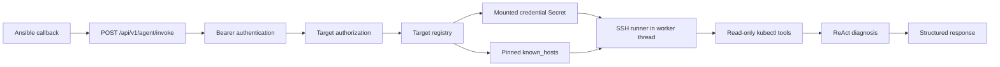

# Ansible-Triggered Remote Cluster Diagnostics Plan

**Status:** Proposed and ready for implementation review  
**Base branch:** `feat/agent-harness`  
**Primary endpoint:** `POST /api/v1/agent/invoke`  
**Scope:** Live, read-only diagnosis of standalone kubeadm clusters after an
Ansible failure

## 1. Objective

When an Ansible playbook fails, its callback should invoke the agent with the
failure details and an explicit environment identifier. The agent should:

1. authenticate and authorize the caller for that environment;
2. resolve the environment to a server-managed SSH target;
3. connect to the kubeadm control-plane node;
4. collect current Kubernetes evidence using read-only tools;
5. combine that evidence with the Ansible failure;
6. return a structured diagnosis that clearly states whether live evidence was
   collected.

The API request must not contain reusable SSH passwords, private keys, or
arbitrary connection destinations.

## 2. Agreed Design Decisions

The following decisions are requirements, not optional implementation ideas.

- The callback sends `target_id`; the backend resolves connection metadata and
  credentials.
- SSH credentials never appear in the API request body.
- The request-scoped kubectl runner is installed inside the worker thread that
  executes the ReAct loop and is always reset in `finally`.
- A requested remote target must never fall back to the backend pod's local
  Kubernetes context.
- Responses distinguish error-only inference from live, verified diagnosis.
- Kubernetes and host diagnostics are read-only.
- The model never receives an arbitrary shell-execution capability.
- Ansible inventory explicitly defines `agent_target_id`; it is not inferred
  from hostname naming conventions.
- Existing browser-driven `/api/chat` SSH behavior remains unchanged in v1.

### 2.1 Feedback reconciliation: bearer-token scope

The feedback proposed both a token per environment group and a single shared
token with a target allowlist. These provide different security properties.

A shared token can restrict the set of registered targets globally, but cannot
distinguish which caller is allowed to use which target. Because remote
diagnosis grants network access to managed environments, v1 will use
**token-per-environment-group**, for example `qa`, `staging`, and `production`.
Each token scope has an explicit target allowlist.

The current `AGENT_API_TOKEN` remains valid for existing error-only invocation.
It receives no remote target access by default. It may receive target access
only through an explicit configured scope.

Per-token fingerprint-to-target authorization can replace environment-group
tokens later without changing the request contract.

## 3. Current State and Gap

The repository already contains the core execution primitive:

- `mcp/k8s/kubectl_runner.py` provides a request-local runner through
  `ContextVar`.
- `mcp/k8s/ssh_runner.py` provides `SSHKubectlRunner`.
- `ui/backend/routers/chat.py` installs an SSH runner when `/api/chat`
  receives raw SSH credentials.

The machine endpoint does not use that primitive:

- `AgentInvokeRequest` accepts only `input`, `instruction`, and `context`.
- `_execute_agent()` creates a `ChatRequest` without an SSH target.
- Any live tool selected during `/api/v1/agent/invoke` therefore uses the
  backend's default Kubernetes context.

Consequently, the current endpoint can analyze the supplied error but cannot
claim that it investigated the standalone kubeadm cluster where the playbook
failed.

## 4. V1 Scope

### Included

- Optional `target` object on `/api/v1/agent/invoke`.
- Server-managed target registry.
- Token-scope-to-target authorization.
- Direct SSH to one registered kubeadm control-plane host.
- Optional bastion support only when direct network routing is unavailable.
- Password or private-key credentials loaded from mounted Kubernetes Secrets;
  private key is preferred.
- Pinned SSH host keys with fail-closed verification.
- Kubernetes-scope, read-only diagnostics.
- Explicit connection, diagnostic, and total time budgets.
- Per-target connection circuit breaker.
- Structured connection status, diagnostic mode, and evidence in the response.
- Helm configuration, NetworkPolicy rules, metrics, audit events, tests, and
  operator documentation.

### Deferred to v2

- Vault SSH client-signer integration and five-minute SSH certificates.
- Host-scope diagnostic commands such as `journalctl`, `systemctl`, `crictl`,
  disk, route, and certificate checks.
- Migration of `/api/chat` from raw credentials to `target_id`.
- Shared circuit-breaker/rate-limit state across replicas.
- Dynamic target administration through an API.
- Write or recovery operations from an automated Ansible callback.
- Per-target SSH connection pooling (approximately 30-second idle TTL and at
  most one idle connection per target). V1 opens a fresh SSH connection for
  every request.

Host-level failures that occur before Kubernetes is usable will receive an
error-only diagnosis in v1. The response must say that host evidence was not
collected.

The v1 `kubernetes` diagnostic scope includes the existing read-only kubectl
and Helm investigation tools. Helm does not receive a separate API scope
because it uses the same remote target, kubeconfig, and read-only trust
boundary.

## 5. V1 Architecture



The backend pod must have an actual TCP route to the destination control-plane
host or its bastion. Selecting `connection_type: ssh` does not create network
reachability.

## 6. API Contract

### 6.1 Request

`target` is optional so existing error-only clients remain compatible.

```json
{
  "instruction": "Diagnose this Ansible failure using live cluster evidence.",
  "input": {
    "event": "runner_on_failed",
    "playbook": "deploy_application.yml",
    "play": "Deploy application",
    "task": "Wait for deployment",
    "action": "kubernetes.core.k8s_info",
    "failed_host": "qa17-worker-08",
    "result": {
      "msg": "Deployment exceeded its progress deadline",
      "stderr": "",
      "rc": 1
    }
  },
  "context": {
    "environment": "qa17",
    "namespace": "payments",
    "job_id": "ansible-18442"
  },
  "target": {
    "connection_type": "ssh",
    "target_id": "qa17",
    "diagnostic_scope": ["kubernetes"]
  }
}
```

Proposed request models:

```python
class AgentTargetRequest(BaseModel):
    model_config = ConfigDict(extra="forbid")

    connection_type: Literal["ssh"]
    target_id: str = Field(pattern=r"^[a-z0-9][a-z0-9-]{0,62}$")
    diagnostic_scope: set[Literal["kubernetes"]] = {"kubernetes"}


class AgentInvokeRequest(BaseModel):
    model_config = ConfigDict(extra="forbid")

    input: Any
    instruction: str
    context: dict[str, Any] = {}
    target: AgentTargetRequest | None = None
```

The request cannot override host, port, username, credential reference,
kubeconfig, host-key policy, bastion, or tool permissions.

### 6.2 Response

Extend the existing response without removing current fields:

```json
{
  "request_id": "req-...",
  "run_id": "run-...",
  "status": "completed",
  "diagnostic_mode": "live_cluster",
  "connection": {
    "type": "ssh",
    "target_id": "qa17",
    "verified": true,
    "reason": null,
    "connected_host": "qa17-control-plane",
    "kube_system_uid": "1c43...",
    "duration_ms": 842
  },
  "answer": "The deployment is blocked because...",
  "tool_used": "investigate_workload",
  "tool_result": {},
  "evidence": [
    {
      "source": "kubernetes",
      "tool": "get_events",
      "summary": "ProgressDeadlineExceeded for deployment/payments-api",
      "target_id": "qa17",
      "observed_at": "2026-06-30T15:10:00Z"
    }
  ],
  "steps": [],
  "suggested_actions": [],
  "timing_ms": 4320,
  "error": null
}
```

`diagnostic_mode` values:

- `error_only`: diagnosis used only request data and stored knowledge.
- `live_cluster`: remote cluster identity was verified and live evidence was
  collected.
- `live_cluster_partial`: identity was verified, but one or more requested
  evidence calls failed or timed out.

`connection.verified` may be true only after SSH host-key validation and the
cluster preflight both succeed.

When a target is requested but connection or verification fails:

- do not install or use the default local runner;
- run only the bounded error-analysis path;
- return `diagnostic_mode: error_only`;
- set `connection.verified: false`;
- provide a sanitized `connection.reason`;
- never include credential details or raw transport exceptions.

### 6.3 HTTP status behavior

- `200`: diagnosis completed, including an error-only fallback.
- `401`: missing or invalid bearer token.
- `403`: caller token is not authorized for `target_id` or scope.
- `404`: unknown or disabled `target_id`.
- `422`: invalid target/request schema.
- `429`: API rate/concurrency limit exceeded.
- `500`: internal execution failure with no valid response.

A failed SSH connection normally returns `200` with an error-only diagnosis and
explicit connection metadata. This lets the Ansible callback show useful
analysis without treating the diagnostic service as the original playbook
failure.

## 7. Target Registry and Credentials

### 7.1 Non-secret target metadata

Store reviewed target metadata in a dedicated ConfigMap. Example logical
content:

```yaml
targets:
  qa17:
    enabled: true
    display_name: QA 17
    environment_group: qa
    connection:
      type: ssh
      host: 10.40.17.10
      port: 22
      username: k8s-diagnostics
      known_hosts_alias: qa17-control-plane
      credential_path: /var/run/agent-target-credentials/qa17
    expected_kube_system_uid: 1c43dff0-0000-0000-0000-000000000000
    diagnostic_scopes_allowed:
      - kubernetes
    allowed_caller_scopes:
      - qa-ansible
```

This ConfigMap contains no password, private key, bearer token, or kubeconfig.
`credential_path` is an opaque mounted-file location, not secret material.

The registry loader must:

- validate the complete file at startup;
- reject duplicate IDs, invalid hosts/ports, unknown scopes, missing expected
  cluster identity, and paths outside the credential mount root;
- expose immutable target objects to request handlers;
- fail closed for an invalid target;
- support a controlled reload or require a pod rollout after changes.

### 7.2 Secret material

Use externally created Kubernetes Secrets, projected read-only into:

```text
/var/run/agent-target-credentials/<target_id>/
```

Each target supports exactly one v1 authentication form:

- `password`, for compatibility with the current runner; or
- `private_key` plus optional `private_key_passphrase`, preferred.

Set secret file permissions to `0400`, use a read-only mount, and ensure audit
and application logs never record file contents.

The backend ServiceAccount should not receive general Kubernetes `get secrets`
permission. Project only explicitly configured Secret keys into the pod.

Production destination: replace persistent key/password files with Vault
SSH certificates valid for approximately five minutes. Keep the target and API
contracts unchanged so that this becomes a credential-provider replacement.

### 7.3 Known hosts

Store public SSH host keys in a ConfigMap-mounted `known_hosts` file. Public host
keys are not credentials.

The runner must call `load_host_keys()` and use
`paramiko.RejectPolicy`. Remove `AutoAddPolicy`. A missing or changed host key
is a verification failure and must open no interactive acceptance path.

For non-default ports, use the OpenSSH `[host]:port` known-hosts form. If the
registry uses an alias, the implementation must consistently verify that alias
instead of the untrusted request value.

The host-key trust procedure is:

1. During bootstrap, the environment owner reads
   `/etc/ssh/ssh_host_ed25519_key.pub` directly on the VM through an
   already-trusted console or bootstrap session.
2. The owner records its fingerprint with
   `ssh-keygen -l -E sha256 -f /etc/ssh/ssh_host_ed25519_key.pub`.
3. The full public key and fingerprint are delivered through the reviewed
   environment configuration PR or another approved out-of-band channel.
4. The agent operator may use `ssh-keyscan` from the backend network to confirm
   that the presented key matches, but must not treat `ssh-keyscan` alone as
   the source of trust.
5. Only the independently verified public key is added to the mounted
   `known_hosts` ConfigMap.

## 8. Caller Authentication and Authorization

V1 caller scopes:

```yaml
callerScopes:
  qa-ansible:
    tokenSecretRef:
      name: agent-api-caller-tokens
      key: qa-current
    previousTokenSecretRef:
      name: agent-api-caller-tokens
      key: qa-previous
    allowedTargetIds:
      - qa01
      - qa02
      - qa17
```

Requirements:

- Load tokens from Kubernetes Secret references, never a ConfigMap.
- Preserve current/previous token rotation.
- Compare tokens using `hmac.compare_digest`.
- Record only `sha256(token)[:8]` in metrics and audit entries.
- Resolve caller scope before target lookup or SSH connection.
- Require both caller `allowedTargetIds` and target
  `allowed_caller_scopes` to match.
- Apply rate limiting per caller fingerprint.
- Never let request fields choose or expand authorization scope.

The existing unscoped token can continue invoking the endpoint without a
target. Remote access through that token is disabled by default.

Each caller scope rotates independently. Rotating the `tokenSecretRef` /
`previousTokenSecretRef` pair for `qa-ansible` has no effect on
`staging-ansible` or any other scope. Operators may roll one environment
group's tokens without coordinating with the others.

## 9. Remote Execution Lifecycle

Target resolution and runner installation must occur inside `_execute_agent()`,
which runs in the worker thread:

```python
target_config = registry.authorize_and_resolve(caller_scope, body.target)
ssh_runner = None
runner_token = None

try:
    ssh_runner = runner_factory.create(target_config, deadlines)
    ssh_runner.connect()
    verified_identity = verify_cluster_identity(ssh_runner, target_config)
    runner_token = set_runner(ssh_runner)
    return execute_react_with_live_tools(...)
except RemoteConnectionError as exc:
    return execute_error_only(..., sanitized_reason=classify(exc))
finally:
    if runner_token is not None:
        runner_ctx.reset(runner_token)
    if ssh_runner is not None:
        ssh_runner.close()
```

The real implementation must preserve the existing agent semaphore and
disconnect behavior.

### 9.1 Cluster identity preflight

After SSH succeeds and before live tools become available:

1. run a bounded `kubectl version -o json --request-timeout=<remaining>`;
2. read the current context for audit metadata;
3. read the `kube-system` namespace UID;
4. compare it to `expected_kube_system_uid` from the registry.

A mismatch means the SSH host is valid but points to the wrong cluster. Treat
this as an unverified connection, close it, and use error-only mode.

`kube_system_uid` is specifically the Kubernetes metadata UID of the
`kube-system` namespace; it is not a separate apiserver-reported cluster ID.
It is stable across normal apiserver restarts. If a cluster is rebuilt and the
`kube-system` namespace is recreated, operators must refresh
`expected_kube_system_uid` in the target registry or all live investigations
for that target will correctly fall back to error-only mode with an identity
mismatch.

### 9.2 No local fallback

This is a mandatory regression test.

If a request includes `target`, any failure before runner installation must use
an explicit no-live-tools/error-only execution path. It must not allow
`get_runner()` to return the global backend kubectl runner. Otherwise a qa17
failure could be "diagnosed" using resources from the assistant's own cluster.

### 9.3 Read-only enforcement

V1 exposes only existing read-only Kubernetes and Helm investigation tools.
Both are covered by the `kubernetes` diagnostic scope.
Automated invocation must not expose recovery tools even when the deployment's
interactive recovery feature is enabled.

Enforce this in dispatch/tool policy, not only in the prompt. The model cannot
override it.

Suggested commands in the response may describe remediation, but the callback
does not execute them.

## 10. Time Budgets

Add the following Helm/application settings:

```yaml
backend:
  agentApi:
    executionTimeoutSeconds: "90"
    connectionTimeoutSeconds: "10"
    diagnosticPhaseTimeoutSeconds: "30"
```

Semantics:

- `executionTimeoutSeconds` is the total wall-clock deadline and includes
  connection, evidence gathering, LLM calls, and synthesis.
- `connectionTimeoutSeconds` caps DNS, TCP connect, SSH handshake, and
  authentication.
- `diagnosticPhaseTimeoutSeconds` is a cumulative budget for SSH-backed
  preflight and tool calls, not a fresh timeout for every command.
- Each operation receives `min(its configured timeout, remaining phase budget,
  remaining total budget)`.
- When the diagnostic budget expires, stop issuing remote calls and return
  partial or error-only mode as appropriate.
- The deadline must be checked inside the worker and passed into SSH, kubectl,
  tools, and the LLM provider. `asyncio.wait_for()` alone is insufficient
  because it cannot terminate the worker thread.

## 11. Per-Target Circuit Breaker

Implement a thread-safe, in-process circuit breaker keyed by `target_id`.

Initial policy:

- count connection, authentication, host-key, and cluster-verification failures;
- open after 3 failures within 60 seconds;
- remain open for 5 minutes;
- allow one half-open probe after the cooldown;
- close after a successful verified connection;
- do not count resource-not-found or ordinary kubectl diagnostic results.

When open:

- skip SSH immediately;
- use the bounded error-only path;
- return `connection.verified: false`;
- return `connection.reason: target_temporarily_degraded`;
- emit a circuit-open metric and sanitized audit event.

The breaker is per process in v1. With multiple workers/replicas, each process
has independent state. Document this limitation. A shared Redis-backed breaker
is deferred until strict fleet-wide behavior is required.

The circuit breaker reduces repeated SSH connection occupancy. Normal API rate
and concurrency limits still apply to the subsequent error-only analysis.

## 12. Network and Bastion Requirements

Add explicit Helm values:

```yaml
networkPolicy:
  targetSshEgress:
    - cidr: 10.40.17.0/24
      ports: [22]
    - cidr: 10.50.0.0/16
      ports: [22]
  bastionEgress:
    - cidr: 10.99.0.5/32
      ports: [22]
```

Render these as backend-only egress rules in
`templates/app-networkpolicies.yaml`.

Requirements:

- never add unrestricted `0.0.0.0/0:22`;
- list approved environment CIDRs or bastion `/32` addresses;
- confirm the backend's egress source IP and destination firewall rules;
- verify DNS resolution from the backend pod;
- include SSH rules in `allow-only` before moving to `enforce-all`;
- if production is bastion-only, allow egress only to the bastion and implement
  nested Paramiko jump-host transport.

Bastion support is part of v1 only if the Phase 0 reachability test shows that
direct routing is unavailable. Do not implement unused bastion complexity.

If bastion support is required, implement it with nested Paramiko clients:

1. connect the outer `SSHClient` to the pinned bastion;
2. open a `direct-tcpip` channel from the outer transport to the registered
   target;
3. pass that channel as `sock=` to the inner target `SSHClient.connect()`;
4. apply independent pinned-host-key validation to both connections;
5. close the inner client, channel, and outer client in the same `finally`
   lifecycle;
6. apply the single connection-phase deadline across both handshakes.

Do not implement bastion routing through an OpenSSH subprocess or shell
`ProxyCommand`. Tests must prove that inner failure and request cancellation
close the outer transport and channel so file descriptors cannot leak.

## 13. Ansible Callback Contract

The callback obtains the target from explicit inventory data:

```yaml
# group_vars/qa17/all.yml
agent_target_id: qa17
agent_diagnostic_scope:
  - kubernetes
```

It obtains only the API URL and caller bearer token from its execution
environment:

```text
DEVOPS_AGENT_API_URL
DEVOPS_AGENT_API_TOKEN
```

It must not read, transmit, or log SSH credentials.

Callback behavior:

- invoke once per meaningful failed task, not once per failed host result when
  the results are identical;
- honor Ansible `no_log`;
- recursively redact common secrets before serialization;
- cap error and result field sizes;
- set a short HTTP connection timeout and a total timeout slightly above the
  agent API total deadline;
- handle `429` using `Retry-After` with at most one retry;
- cap diagnoses per playbook run;
- print `diagnostic_mode`, connection verification, evidence summary,
  diagnosis, and recommended actions;
- never replace or change the original Ansible failure status;
- degrade cleanly when the agent is unavailable.

The callback implementation belongs in the Ansible/playbook repository, not
this repository. Add an example callback and inventory variables there after
the backend contract is available in staging.

### 13.1 Contract as implemented (v1 — Phases 1–6)

Phases 1–6 landed on `feat/agent-harness`. This subsection is the reference
callback authors code against — it is the stable surface, not aspirational
design. If the code disagrees with this text, the code wins and this section
is stale; open a PR.

**Request body** — `POST /api/v1/agent/invoke`

Content-Type: `application/json`. Body is validated by Pydantic with
`extra="forbid"`, so any extra top-level or nested key returns 422.
Maximum raw body size (default 65 536 bytes) returns 413.

```json
{
  "instruction": "Diagnose this Ansible failure using live cluster evidence.",
  "input": { "...": "arbitrary redacted JSON — the failed task result" },
  "context": { "environment": "qa17", "namespace": "payments", "job_id": "ansible-18442" },
  "target": {
    "connection_type": "ssh",
    "target_id": "qa17",
    "diagnostic_scope": ["kubernetes"]
  }
}
```

Field rules:

- `instruction` — 1 – 4 000 characters. Omit to accept the server default.
- `input` — any JSON value. Callers redact secrets before sending (plan
  §13 bullet 3). The backend runs a second-line redactor over the response.
- `context` — plain map. Any secret-shaped values (keys containing
  `password`, `token`, `secret`, `authorization`, `credential`, `passphrase`,
  `api_key`, `private_key`) are redacted before appearing in the response.
- `target.connection_type` — must be the literal string `"ssh"`; other
  values return 422.
- `target.target_id` — must match `^[a-z0-9][a-z0-9-]{0,62}$`. Unknown or
  disabled IDs return 404. IDs the caller's scope is not allowed to reach
  return 403.
- `target.diagnostic_scope` — a set. v1 accepts only `["kubernetes"]`.
  Omit to accept the default. Empty sets return 422; other values return
  422 (Pydantic literal rejection).
- Omit `target` entirely to keep the legacy target-less error-only mode.

**Authentication**

`Authorization: Bearer <token>`. The backend supports two token shapes on
the same header:

1. A per-scope token (recommended) — grants `target_id` access matching the
   scope's `allowed_target_ids`.
2. The legacy `AGENT_API_TOKEN` — grants only the target-less error-only
   mode. Sending a `target` with this token returns 403 `unauthorized`.

Rotation preserves the previous token for a grace window. Both current and
previous tokens are accepted concurrently.

**HTTP status matrix**

| Status | Meaning | Callback action |
|--------|---------|-----------------|
| 200 | Diagnosis returned (may be `error_only`, `live_cluster`, or `live_cluster_partial`) | Render body |
| 401 | Missing or malformed Authorization header | Fail loudly; do not retry |
| 403 | Token not authorized for `target_id` or requested scope | Fail loudly; do not retry |
| 404 | Unknown or disabled `target_id` | Fail loudly; do not retry |
| 413 | Request body over the configured byte limit | Trim input and retry once at most |
| 422 | Schema violation (bad literal, extra key, empty scope) | Fail loudly; do not retry |
| 429 | Rate limit or capacity full — inspect `Retry-After` | Sleep and retry ONCE |
| 500 | Backend internal error | Log and fail cleanly; do not retry |

`200` covers all normal remote-failure outcomes so a broken SSH tunnel or a
mismatched `kube-system` UID still returns useful analysis instead of an
error to the caller. Callbacks distinguish live vs. error-only by reading
`diagnostic_mode` and `connection.verified`, not the HTTP status.

**Response body** — successful (`status: 200`)

```json
{
  "request_id": "req-...",
  "run_id": "run-...",
  "status": "completed",
  "diagnostic_mode": "live_cluster",
  "connection": {
    "type": "ssh",
    "target_id": "qa17",
    "verified": true,
    "reason": null,
    "connected_host": "qa17-control-plane",
    "kube_system_uid": "1c43dff0-0000-0000-0000-000000000000",
    "duration_ms": 842
  },
  "answer": "The deployment is blocked because...",
  "tool_used": "investigate_workload",
  "tool_result": { "...": "redacted tool output" },
  "steps": [
    {"action": "get_events", "status": "ok", "duration_ms": 240, "params": {"namespace": "payments"}}
  ],
  "evidence": [
    {
      "source": "kubernetes",
      "tool": "get_events",
      "summary": "ProgressDeadlineExceeded for deployment/payments-api",
      "target_id": "qa17",
      "observed_at": "2026-06-30T15:10:00Z"
    }
  ],
  "suggested_actions": [],
  "timing_ms": 4320,
  "error": null
}
```

`diagnostic_mode` (bounded enum — the response validator refuses inconsistent
combinations):

| Mode | Meaning | Callback rendering hint |
|------|---------|-------------------------|
| `error_only` | No live cluster contact; body is pure inference. `connection.verified=false`, `evidence=[]`, `kube_system_uid` absent. `reason` explains why. | Show inference as advice; label as "no live evidence". |
| `live_cluster` | SSH + identity preflight passed AND at least one evidence tool ran cleanly. | Print `connection.kube_system_uid` and evidence. |
| `live_cluster_partial` | SSH + identity preflight passed but at least one evidence call failed or ReAct did not complete. Evidence array may be non-empty. | Same as `live_cluster` but flag that the picture is incomplete. |

`connection.reason` — bounded 10-value enum, present only when
`verified=false` or the request never reached identity preflight. Callback
authors should map these directly to a short human line (do NOT invent your
own reasons — the enum is closed):

| Reason | Class | Suggested rendering |
|--------|-------|---------------------|
| `connect_timeout` | Transport | "Could not open an SSH connection within the deadline." |
| `auth_failed` | Transport | "SSH authentication failed." |
| `host_key_mismatch` | Transport | "SSH host key did not match the pinned value." |
| `host_key_missing` | Transport | "The target's host key is not registered." |
| `identity_mismatch` | Preflight | "SSH reached a host, but the kube-system UID did not match this environment." |
| `bastion_failed` | Transport | "The intermediate bastion connection failed." |
| `transport_error` | Transport | "SSH transport failed." |
| `circuit_open` | Backend policy | "The target is degraded; retry after the cooldown." |
| `target_disabled` | Backend policy | "The target is currently disabled." |
| `unauthorized` | Backend policy | "This scope is not authorized for that target." (Also returns 403.) |

`error` — either `null` or an object `{"type": <str>, "message": <str>,
"retryable": <bool>}`. The `message` is post-redaction; the `type` is one of
a small set (`agent_execution`, `diagnostic_analysis_failed`,
`remote_transport_failed_after_verification`). Callback should surface the
message but must not retry on `retryable=false` — the backend has already
absorbed the recoverable case.

**Timeouts** — the backend's default budgets are 10 s connection, 30 s
diagnostic phase, 90 s total. The callback should set its own HTTP total
timeout slightly above the total budget (e.g. 100 s) so the backend has time
to serialize the final response even when the diagnostic phase used its full
budget.

**Rate limit** — 30 requests per minute per token fingerprint, plus a hard
concurrency cap. Both surface as 429 with `Retry-After` seconds. Callback
should retry at most once and prefer widening the debounce that decides
"one diagnosis per meaningful failed task" over aggressive retry.

**What the callback still must not do** — this list is unchanged from §13:

- Never include SSH credentials, `host`, `port`, or `username` in the
  request. Registered targets are the only way in.
- Never treat the diagnosis as authoritative playbook status — the original
  Ansible failure remains the source of truth.
- Never issue a follow-up request that executes `suggested_actions`. They
  are read-only advice for a human.
- Never dedupe by playbook name across environments — the token fingerprint
  is what the rate limiter uses.

## 14. Observability and Audit

Add metrics with bounded labels:

- `agent_remote_connection_attempts_total{target_id,status,reason}` —
  `status` is `success` or `failure`. `reason` is a bounded enum of failure
  categories: `connect_timeout`, `auth_failed`, `host_key_mismatch`,
  `host_key_missing`, `identity_mismatch`, `bastion_failed`, `transport_error`,
  `circuit_open`, `target_disabled`, `unauthorized`. On `status=success`,
  `reason` is the empty string. Do not pass raw exception messages into this
  label — map every transport exception to one of the enum values.
- `agent_remote_connection_duration_seconds{target_id}`
- `agent_remote_diagnostic_mode_total{target_id,mode}`
- `agent_remote_circuit_state{target_id}`
- `agent_remote_circuit_open_total{target_id}`
- `agent_remote_tool_duration_seconds{target_id,tool,status}`

Do not label metrics with hostname, error text, job ID, playbook name, username,
or token.

Audit events should include:

- request ID and run ID;
- token fingerprint;
- target ID;
- requested and effective diagnostic scope;
- authorization result;
- connection phase result and sanitized reason;
- verified `kube-system` namespace UID;
- tools invoked and durations;
- final diagnostic mode.

Audit events must never include bearer tokens, passwords, private keys,
passphrases, raw Authorization headers, or unredacted Ansible results.

## 15. Implementation Phases

### Phase 0 — Environment and staging parity gate

**Implementation status:** Checklist and tooling in place. Each
environment must still walk it and file a sign-off issue before its
values flip `remoteDiagnostics.enabled=true`.

Delivered:

- [`docs/ANSIBLE_REMOTE_DIAGNOSTICS_STAGING_CHECKLIST.md`](ANSIBLE_REMOTE_DIAGNOSTICS_STAGING_CHECKLIST.md)
  — owner-grouped checklist for the eight bullets below, expanded with
  concrete pointers into the Phase 6 chart (`remoteDiagnostics.*`
  values, `credentialSecretRef`, `knownHostsEntries`, and the
  [`helm/.../tests/render.sh`](../helm/kubeastra/tests/render.sh)
  fixture).
- [`scripts/verify_remote_diagnostics_target.sh`](../scripts/verify_remote_diagnostics_target.sh)
  — DNS resolution, TCP/22 dial, and SHA-256 host-key fingerprint
  cross-check. Meant to run from a debug pod that mirrors the backend
  pod's egress (works on an operator laptop for smoke testing, but only
  pod-side output is trustworthy for sign-off).
- [`.github/ISSUE_TEMPLATE/remote_diagnostics_staging_signoff.md`](../.github/ISSUE_TEMPLATE/remote_diagnostics_staging_signoff.md)
  — one issue per environment, one reviewer per section, close-out gated
  on Section 7's `live_cluster` smoke test.

Before coding or enabling SSH:

- inventory the intended `target_id` values;
- confirm `agent_target_id` is available in Ansible group variables;
- record control-plane addresses and ports;
- test TCP/22 reachability from the actual backend pod network;
- decide direct versus bastion routing per environment group;
- record backend egress source ranges and firewall requirements;
- collect SSH public keys and verify them using the out-of-band procedure in
  Section 7.3; `ssh-keyscan` alone is not sufficient;
- create the restricted `k8s-diagnostics` OS account;
- confirm that account has a read-only kubeconfig;
- record each expected `kube-system` namespace UID;
- define caller scopes and their target allowlists;
- confirm staging uses the same CNI/NetworkPolicy behavior as production.

Do not proceed to live diagnostics until the target identity and network path
are independently verified.

### Phase 1 — Contract and registry

- Add strict target request/response models.
- Add diagnostic mode, connection metadata, and normalized evidence models.
- Implement target registry parsing and validation.
- Add target registry ConfigMap and read-only mount.
- Add feature flag `backend.agentApi.remoteDiagnostics.enabled`, default false.
- Preserve existing target-less invocation behavior.

### Phase 2 — Scoped machine authentication

- Add caller-scope token Secret references.
- Preserve current/previous token rotation.
- Return a caller scope after bearer authentication.
- Enforce caller-to-target authorization before acquiring remote resources.
- Keep the legacy token target-less by default.
- Add authorization and rotation tests.

### Phase 3 — Harden the SSH runner

**Implementation status:** Complete in the runner and test layers. Deployment
mounts and Helm values remain Phase 6; invoke installation remains Phase 4.

- Replace `AutoAddPolicy` with loaded host keys plus `RejectPolicy`.
- Add mounted private-key authentication while retaining optional password
  compatibility.
- Add explicit connection deadline support.
- Add sanitized connection error categories.
- Add optional bastion support only if Phase 0 requires it.
- Ensure secrets cannot appear in `repr`, logs, traces, exceptions, or audit.

### Phase 4 — Invoke integration and evidence

**Implementation status:** Complete in the backend and runner layers. Runtime
configuration is available directly through environment variables; Helm
values, mounts, and NetworkPolicy rendering remain Phase 6.

- Resolve and authorize the target.
- Create and install the runner inside `_execute_agent()`.
- Verify cluster identity before enabling live tools.
- Add an explicit error-only/no-live-runner path.
- Enforce Kubernetes read-only tool policy for automated invocation.
- Normalize redacted tool observations into `evidence[]`.
- Reset runner context and close SSH in every exit path.
- Propagate total and diagnostic deadlines into every tool call.

Phase 4 runtime variables:

- `AGENT_API_REMOTE_DIAGNOSTICS_ENABLED`
- `AGENT_API_TARGETS_PATH`
- `AGENT_API_TARGET_CREDENTIAL_ROOT`
- `SSH_KNOWN_HOSTS_PATH`
- `AGENT_API_CONNECTION_TIMEOUT_SECONDS`
- `AGENT_API_DIAGNOSTIC_PHASE_TIMEOUT_SECONDS`
- existing `AGENT_API_EXECUTION_TIMEOUT_SECONDS`

When the feature is enabled, startup fails closed if the target registry is
missing/empty or the pinned `known_hosts` file is unavailable. Target
authorization occurs before semaphore acquisition. Breaker admission,
connection, identity preflight, runner installation, and cleanup occur inside
the worker thread.

Targetless invocations are strictly `error_only`: they use the input analyzer
and never enter ReAct or inherit the backend's local Kubernetes runner.
For `kubernetes.core.k8s` failures, the analyzer receives `msg`/`stderr` as
classifier text while container images and status conditions are passed as
separate caller-supplied request evidence. Error-only answers are linted for
live-observation phrases; matches emit a metadata-only
`hallucinated_evidence` audit event without rewriting the response.

### Phase 5 — Circuit breaker and telemetry

- Add the per-target circuit-breaker state machine.
- Short-circuit degraded targets.
- Add metrics and audit events.
- Document per-process circuit-breaker and rate-limit behavior.
- Verify that disconnects still retain the execution slot until the worker
  actually exits.

### Phase 6 — Helm and NetworkPolicy

**Implementation status:** Complete.

- Add remote-diagnostic values and config.
- Mount the target registry, known-hosts ConfigMap, and explicit target Secrets.
- Add connection and diagnostic timeout environment variables.
- Add target and bastion SSH egress lists.
- Update chart comments, schema if present, deployment guide, and API guide.
- Run Helm lint and render tests for disabled, direct-SSH, and bastion variants.

Delivered in this repository:

- `helm/kubeastra/values.yaml` — new `remoteDiagnostics` section
  (enabled flag defaults to false, non-secret target metadata, caller scope
  metadata, pinned known-hosts entries, target/bastion egress CIDRs).
- `helm/kubeastra/templates/agent-remote-diagnostics-config.yaml`
  — projects the target registry (`targets.yaml`), caller scope registry
  (`caller-scopes.yaml`), and pinned `ssh_known_hosts` file. Fails closed at
  `helm template` time on empty registries, wildcard egress CIDRs, or missing
  `credentialSecretRef` / `tokenSecretRef`.
- `helm/kubeastra/templates/backend-deployment.yaml` — installs
  the ConfigMap, per-target credential Secrets (0400), and per-scope caller
  token Secrets (0400), gated by `.Values.remoteDiagnostics.enabled`. New env
  vars: `AGENT_API_REMOTE_DIAGNOSTICS_ENABLED`, `AGENT_API_TARGETS_PATH`,
  `AGENT_API_CALLER_SCOPES_PATH`, `AGENT_API_TARGET_CREDENTIAL_ROOT`,
  `AGENT_API_TOKEN_MOUNT_ROOT`, `SSH_KNOWN_HOSTS_PATH`,
  `AGENT_API_CONNECTION_TIMEOUT_SECONDS`,
  `AGENT_API_DIAGNOSTIC_PHASE_TIMEOUT_SECONDS`.
- `helm/kubeastra/templates/app-networkpolicies.yaml` — appends
  the SSH target/bastion egress rules, rendered only when both
  `networkPolicy.enabled` and `remoteDiagnostics.enabled` are true.
- `helm/kubeastra/tests/` — reusable fixture values for the
  direct-SSH and bastion scenarios plus `render.sh`, which runs `helm
  template` against three positive and three negative scenarios and exits
  non-zero on any regression.

Runtime prerequisites operators still control:

- Kubernetes Secrets named in each target's `credentialSecretRef` (mounted at
  `/var/run/agent-target-credentials/<target_id>/`, one of `key`+optional
  `passphrase` or `password`) and each scope's `tokenSecretRef` (mounted at
  `/var/run/agent-caller-tokens/<scope>/<currentTokenKey>` and optional
  `<previousTokenKey>`). These Secrets are created out-of-band —
  sealed-secrets, external-secrets-operator, or `kubectl create secret`.
- Reviewed pinned host keys — trust must come from the §7.3 out-of-band
  procedure, not `ssh-keyscan`.

### Phase 7 — Ansible callback repository

**Implementation status:** Not started. Backend contract is stable — see
§13.1 "Contract as implemented". The callback work lives in the
Ansible/playbook repository, not this one.

- Add explicit `agent_target_id` inventory examples.
- Update the callback request to include `target`.
- Add response rendering for evidence level and connection verification.
- Add redaction, deduplication, retry, and per-run caps.
- Test against the staging endpoint using one canary environment.

Concrete deliverables for the callback PR — each one maps to a specific
backend contract landed in Phases 1–6:

- **Inventory contract** (from §13): every environment group has
  `agent_target_id` set in its `group_vars`. Do not derive `target_id` from
  hostname naming conventions or `inventory_hostname`.
- **Request builder** (from §13.1): serialize `{connection_type: "ssh",
  target_id: <inv>, diagnostic_scope: ["kubernetes"]}` and include it as
  the `target` field. Never construct `host`, `port`, `username`, or any
  credential field — the backend rejects the request with 422 if you do.
- **Deduplication** (from §13 bullet 1): fire once per meaningful failed
  task, not per failed host row when the result payload is identical. The
  Ansible callback API exposes `runner_on_failed` — de-dupe by the tuple
  `(playbook, play, task, action, redacted_error_hash)` within a single run.
- **Redaction before serialization** (from §13 bullet 3): honor `no_log`;
  recursively remove keys matching the secret-key list; cap `input`,
  `context.result`, and any error text to configurable byte limits. The
  backend does defense-in-depth redaction on the response but not the
  request; a leaked secret in the request body would still land in the
  audit log.
- **HTTP timeout** (from §13.1 "Timeouts"): total HTTP timeout ~100 s
  (backend total 90 s + serialization slack). Connect timeout 5 s.
- **429 handling** (from §13.1 "Rate limit"): honor `Retry-After` with at
  most one retry. Do not retry other 4xx.
- **Response rendering** (from §13.1 "diagnostic_mode" and
  "connection.reason"): use the enum tables verbatim — treat any unknown
  value as an internal-error signal. Print `connection.kube_system_uid`
  when `verified=true` so operators can confirm the callback investigated
  the intended environment.
- **`suggested_actions` are read-only advice** (from §9.3 and §13): render
  them; never execute. Playbook status remains whatever Ansible decided.
- **Failure containment** (from §13 last bullet): when the agent is
  unreachable or returns 5xx, log a single line and continue. The callback
  must not fail the playbook run.
- **Per-run cap** (from §13 bullet 7): configurable limit on total
  diagnoses per playbook execution — 5 is a sensible default for CI.
- **Canary rollout** (from Phase 8): configure the callback with the
  staging endpoint URL and one non-production `target_id` first; only add
  QA / production targets after Phase 8 signoff.

### Phase 8 — Staged rollout

1. Deploy with remote diagnostics disabled.
2. Load one non-production target and caller scope.
3. Enable NetworkPolicy rules in `allow-only`.
4. Verify host-key rejection, authorization denial, timeout, and circuit-open
   behavior.
5. Enable remote diagnostics for the canary target.
6. Compare reported evidence against manual kubectl results.
7. Progress NetworkPolicy through `enforce-ingress` and `enforce-all`.
8. Add QA targets in small batches.
9. Add production only after its routing, credential, and audit model is
   approved.

### Phase 9 — V2 capabilities

- Replace persistent credentials with Vault short-lived SSH certificates.
- Add an allowlisted host diagnostics runner.
- Add per-token fingerprint scopes if environment-group tokens no longer scale.
- Move breaker/rate-limit state to a shared store if replicas increase.
- Consider migrating `/api/chat` to `target_id` with a separate deprecation
  plan for raw credential requests.

### Final separate-branch item — Alert polling

`GET /api/v1/alerts/{id}` is not part of this branch or remote-diagnostics
implementation. Keep it as the final follow-up on the branch containing the
alert workflow (`feat/merge-alert-manager`) after the `feat/agent-harness`
remote-diagnostics work is reviewed. Do not mix alert code into this plan's
implementation commits.

## 16. Test Plan

### Unit tests

- Request rejects host, username, password, credential, and unknown fields.
- Registry rejects malformed or duplicate targets.
- Unknown/disabled targets fail closed.
- Legacy token cannot access remote targets by default.
- Scoped token can access only its target allowlist.
- Current and previous scoped tokens both work during rotation.
- Host-key match succeeds; missing/mismatched key fails.
- Credentials are loaded only from the mounted target path.
- Connection, diagnostic, and total deadlines are enforced.
- `kube-system` namespace UID mismatch produces error-only mode.
- Circuit opens, short-circuits, half-opens, and closes correctly.
- Secret redaction covers response, steps, metrics, logs, and audit.

### Concurrency tests

- Two simultaneous requests for different targets do not share runners.
- Context is reset after success, connection failure, tool failure, timeout,
  cancellation, and synthesis failure.
- A failed remote target never invokes the global local runner.
- A disconnected client retains its slot until the worker exits.
- An open circuit avoids repeated SSH attempts.

### Integration tests

- Fake SSH server exercises authentication and host-key validation.
- Fake remote kubectl returns a known `kube-system` namespace UID and evidence.
- Wrong `kube-system` namespace UID is rejected.
- Authorized request produces `live_cluster`.
- Partial tool timeout produces `live_cluster_partial`.
- Unreachable target produces `error_only` with a sanitized reason.
- Suggested recovery actions are returned but never executed.

### Helm tests

- Feature disabled renders no target credential mounts.
- Registry and known-host mounts are read-only.
- Secret file modes are restrictive.
- Direct SSH CIDRs render only configured port-22 rules.
- Bastion `/32` renders without target-subnet egress.
- No chart variant renders `0.0.0.0/0:22`.
- Existing installs without remote-diagnostic values remain valid.

### End-to-end staging test

Trigger a controlled Ansible deployment failure in the canary environment and
verify:

- callback selects the explicit `agent_target_id`;
- response target matches the failed environment;
- `kube-system` namespace UID is verified;
- evidence matches manual kubectl output;
- no credential appears in Ansible artifacts or backend logs;
- original playbook failure remains unchanged;
- agent unavailability does not block playbook completion indefinitely.

## 17. Definition of Done

The v1 work is complete only when:

- an authorized Ansible callback can request a registered QA target;
- the backend verifies SSH and cluster identity;
- the agent returns live, redacted Kubernetes evidence;
- unauthorized target access is denied before connection;
- connection failure cannot fall back to the local cluster;
- host keys are pinned and credentials remain server-side;
- all remote tools are enforced read-only;
- circuit breaking and deadlines protect agent capacity;
- Helm and NetworkPolicy support least-privilege SSH egress;
- focused backend/MCP tests, full suites, Helm lint, and rendered-manifest
  checks pass;
- staging proves that `live_cluster` and `error_only` are operationally
  distinguishable.
