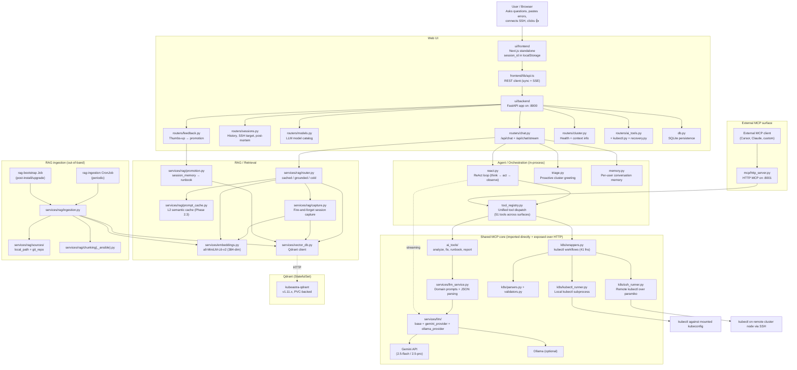
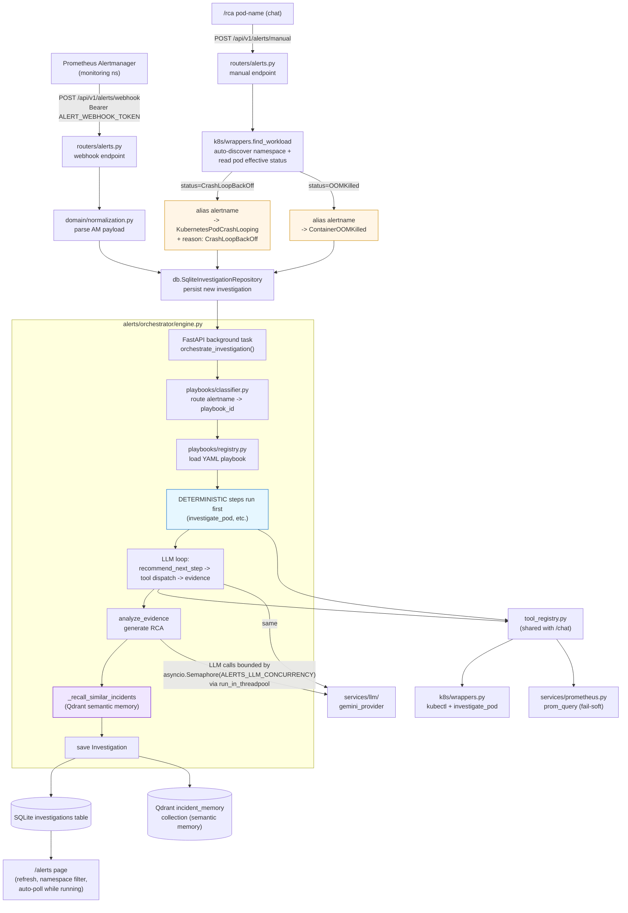
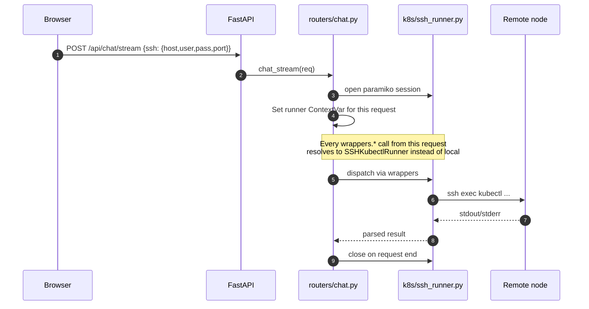
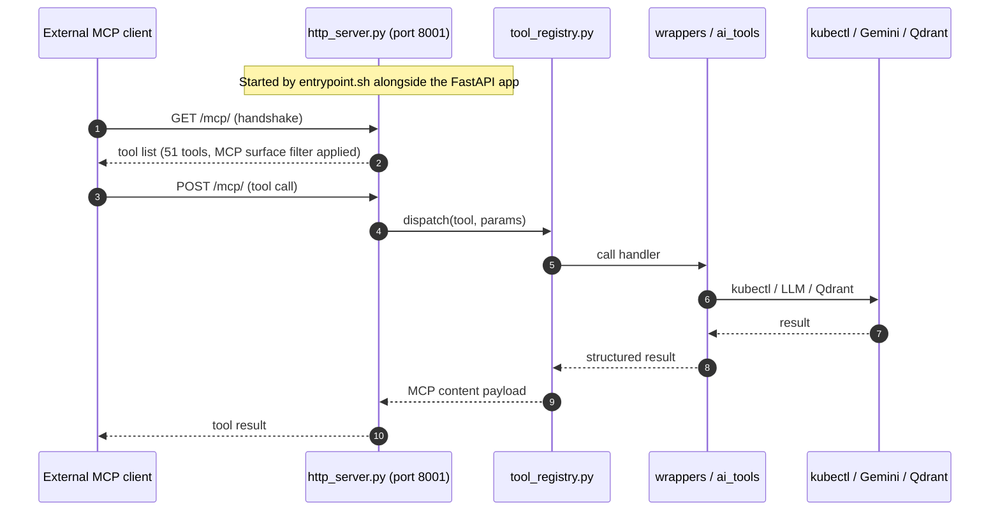
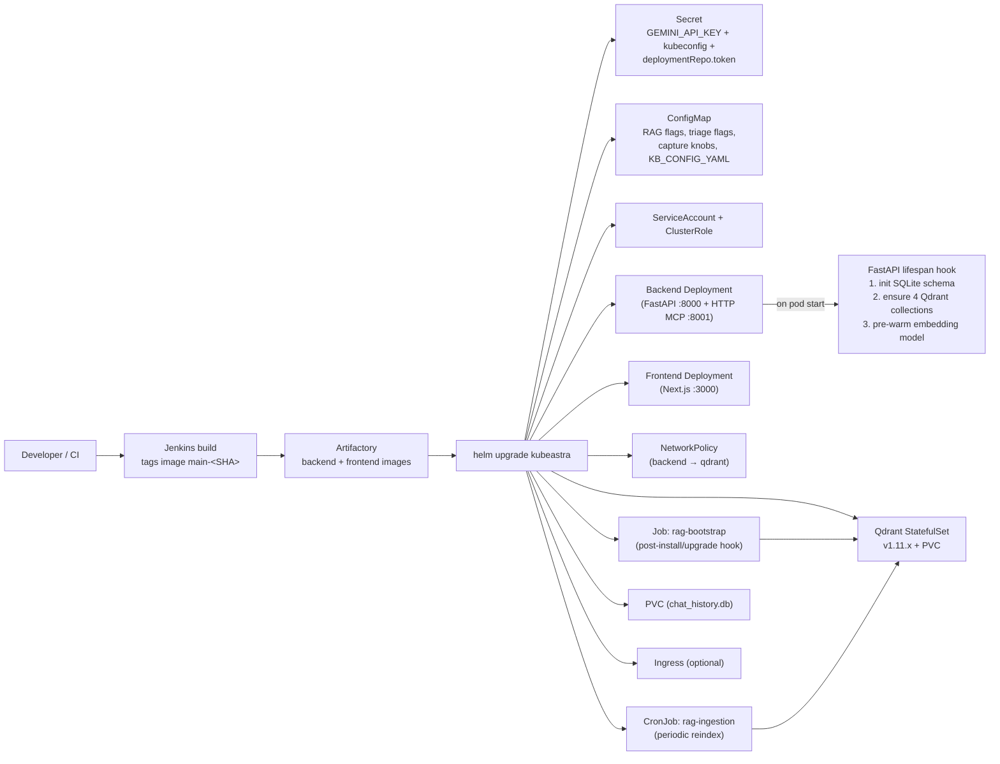

# KubeAstra Assistant — Architecture Diagram

This document explains how the repository fits together, which components call which other components, and when each path is used.

> **Up-to-date as of:** Phase 3.0 (proactive triage). Covers Phases 1.1 – 1.5 (RAG, deployment-repo KB), 2.2 (conversation memory), 2.3 (semantic prompt cache), and 3.0 (proactive cluster triage).

---

## 1. Repository-level architecture



**What this shows that the previous diagram missed:** Qdrant (the RAG store, replaced Weaviate in Phase 1.1), the entire `services/rag/` subsystem, the agent layer (`react.py`, `memory.py`, `triage.py`), the unified `tool_registry.py`, the ingestion CronJob/Job, the LLM provider split (`services/llm/`) vs. the domain LLM service (`services/llm_service.py`), and the HTTP MCP surface on :8001.

**Two LLM call-paths.** `ai_tools/*` calls `services/llm_service.py` which carries the domain prompts (error analysis JSON schema, runbook templates) and *then* talks to a provider in `services/llm/`. `react.py`, `triage.py`, `capture.py`, and other streaming callers skip the domain wrapper and talk to `services/llm/get_provider()` directly with their own prompts. Same providers, different prompt-ownership.

---

## 1b. Alerts & investigations subsystem (merged-in alert manager)

The merged-in subsystem adds a second front door to the same backend:
**Alertmanager webhooks** and the **`/rca`** chat slash command. Both feed
the same orchestrator, which dispatches MCP tools (sharing the registry
with `/chat`) and produces a persisted `Investigation` rendered by the
`/alerts` UI.



**What this adds on top of section 1's main diagram:**

- **Two ingress paths, one orchestrator.** Real Alertmanager webhooks and
  `/rca` slash commands hit the same `routers/alerts.py` -> same
  `InvestigationOrchestrator` -> same playbook engine. The only difference
  is how the synthetic alert is built.
- **Smart `/rca` routing.** When the user types `/rca jenkins-legacy-0`, the
  `/manual` endpoint runs `find_workload` to (a) auto-discover the
  namespace and (b) read the pod's effective `status` (e.g.
  `CrashLoopBackOff`, `OOMKilled`). If the status maps to a specialty
  playbook, the synthetic alertname is **aliased** (e.g.
  `ManualPodInvestigation` -> `KubernetesPodCrashLooping`) so the
  classifier routes to the specialty playbook instead of generic-pod.
- **Deterministic playbook steps run BEFORE the LLM loop.** Playbook YAML
  fields marked `deterministic: true` (e.g. the `investigate_pod` step in
  `crashloopbackoff.yaml`) execute unconditionally first. This matches
  `/chat`'s composite-tool depth and prevents the LLM from picking raw
  `get_pod_logs` (which defaults to the first container in the spec and
  produces empty evidence on init-container failures).
- **Semantic incident memory.** Each completed investigation is embedded
  via `services/embeddings.py` and stored in the Qdrant
  `incident_memory` collection. The next time a similar alert fires,
  `_recall_similar_incidents` retrieves the top-K past RCAs and injects
  them into the analyze_evidence prompt — the engine carries forward what
  it has previously diagnosed.
- **LLM concurrency cap.** A per-event-loop `asyncio.Semaphore`
  (`ALERTS_LLM_CONCURRENCY=8` by default) bounds simultaneous Gemini
  calls across all in-flight investigations. Calls run on the FastAPI
  threadpool via `run_in_threadpool` so the `/health` probe stays
  responsive during a 35-alert webhook burst. See
  [alert_manager_deploy.md](alert_manager_deploy.md) section 2.5.
- **`prom_query` tool.** Specialty playbooks (`crashloopbackoff`,
  `highcpuusage`, `dependency_call_timeout`) dispatch a fail-soft
  Prometheus client (`services/prometheus.py`) for restart-rate / CPU
  throttling / latency metrics. Configured via `PROMETHEUS_URL`.

For the operator's wiring (token generation, AM Secret mounting,
namespace-driven Helm helpers), see
[alert_manager_deploy.md](alert_manager_deploy.md).

---

## 2. Main runtime flow — streaming chat (the common case)

This is the path taken by 95% of chat traffic: a user types a question, the streaming endpoint emits SSE events as the agent thinks, acts, and answers.

```mermaid
sequenceDiagram
    autonumber
    participant U as Browser
    participant FE as Next.js frontend
    participant BE as FastAPI /api/chat/stream
    participant T as triage.py
    participant R as services/rag/router.py
    participant L as react.py (ReAct loop)
    participant REG as tool_registry.py
    participant Q as Qdrant
    participant LLM as Gemini

    U->>FE: Enter message; click send
    FE->>BE: POST /api/chat/stream (SSE)

    alt First message of session AND triage enabled
        BE->>T: cluster_overview()
        T->>REG: get_pods, get_events
        T-->>BE: markdown greeting + overview
        BE-->>FE: event: triage_greet
    end

    BE->>R: classify(question, embedding)
    R->>Q: search session_memory (L2 cache)
    R->>Q: search runbook + deployment_repo + devops_doc
    R-->>BE: mode = cached | grounded | cold

    alt mode == cached (Phase 2.3 or Phase 1.4 verified hit)
        BE-->>FE: event: kb_route {mode:"cached"}
        BE-->>FE: event: token (cached answer streamed char-by-char)
        BE-->>FE: event: done
    else mode == grounded or cold
        BE-->>FE: event: kb_route {mode, score}
        BE->>L: react_loop(question, grounded_preamble, memory_preamble)
        loop Until answer or max_iterations
            L->>LLM: generate_stream(prompt) — thought + action JSON
            LLM-->>L: streamed JSON chunks
            L-->>FE: event: thought_stream (live "thinking")
            alt action == tool call
                L->>REG: dispatch(tool, params)
                REG-->>L: structured result
                L-->>FE: event: iteration_complete
            else action == answer
                L->>LLM: generate_stream(finalize_prompt)
                LLM-->>L: streamed answer tokens
                L-->>FE: event: token (×N)
                L-->>FE: event: answer_end
            end
        end
        BE->>L: capture (fire-and-forget) → session_memory
        BE-->>FE: event: done {capture_id}
    end

    FE->>U: Renders streaming answer; thumbs-up button bound to capture_id
```

**Key events you'll see in the SSE stream:** `triage_greet` (first turn only), `kb_route`, `thought_stream`, `iteration_complete`, `token`, `answer_end`, `done`. Errors surface as `error` events.

---

## 3. Alternate flow — SSH-backed remote cluster

When the user provides SSH credentials in the UI, all kubectl calls for that request route through paramiko to a remote node. The agent, RAG, and LLM paths are otherwise identical.



SSH credentials are never persisted server-side — the runner lives for the lifetime of the request only. Host/user/port can be remembered per-session in SQLite if the user opts in (no password).

---

## 4. External MCP runtime — HTTP

The MCP layer used to be stdio-only (Cursor). It's now an HTTP MCP server on port `:8001` started by the same backend entrypoint, so any HTTP-capable MCP client can connect.



Auth: `MCP_AUTH_TOKEN` env var enables bearer-token auth on the HTTP surface. Disabled by default (treat as internal-only until set).

The web UI does **not** talk to this HTTP MCP. The backend imports the MCP code directly as a Python library (`from k8s.wrappers import ...`) to avoid an extra network hop. The HTTP MCP exists for external consumers only.

---

## 5. Startup and deployment flow



**Lifespan hook (`main.py:_bootstrap_rag_collections`)** runs on every pod start:
1. `db.init_db()` — creates SQLite tables if missing.
2. Connects to Qdrant; calls `ensure_collection_for` on `runbook`, `devops_doc`, `deployment_repo`, `session_memory`. Idempotent.
3. Runs one throwaway `embeddings.embed("warmup")` so the first chat doesn't pay the 5-10s sentence-transformer load.

All three steps are wrapped in try/except — the pod still boots if Qdrant is unreachable.

---

## 6. When each component is called

| Component | Called by | When | What it does |
|---|---|---|---|
| `frontend/app/chat/page.tsx` | Browser | User opens `/chat` and interacts | Holds chat state, SSH state, stop-button (`AbortController`), SSE consumer |
| `frontend/lib/api.ts` | Chat page | Every API action | REST + SSE client; `sendChatStream` is the streaming path |
| `backend/main.py` (lifespan) | Uvicorn boot | Pod start | DB init + RAG collection bootstrap + embedding warmup |
| `routers/chat.py` `POST /api/chat` | Frontend (legacy sync) | Non-streaming chat | One-shot ReAct or routed-tool answer |
| `routers/chat.py` `POST /api/chat/stream` | Frontend (default) | Every chat turn | SSE stream — triage → router → ReAct/grounded/cached |
| `routers/sessions.py` | Frontend history/SSH/post-mortem APIs | Page load, reconnect, post-mortem export | SQLite-backed history, SSH target metadata, AI-generated post-mortem markdown |
| `routers/models.py` | Older frontend/client compatibility | Optional | Returns the fixed Gemini model catalog used by chat |
| `routers/feedback.py` | UI thumbs-up button | User clicks 👍 on a captured answer | Promotes `session_memory` entry → `runbook` (verified=True) |
| `routers/cluster.py` | Health probes + UI status pill | Page load, probes | Reports kubectl context, AI availability |
| `react.py` `react_loop` | `routers/chat.py` (both paths) | Every grounded/cold chat | Think → act → observe; streams thought + answer events |
| `triage.py` `cluster_overview` | `chat_stream` first turn | Once per session if `enableProactiveTriage=true` | Read-only scan; surfaces CrashLooping/Pending pods + Warning events |
| `memory.py` `build_memory_preamble` | `react_loop` and finalize calls | Every grounded/cold chat | Renders "you've recently been working on namespaces=X, tools=Y" as prompt prefix |
| `services/rag/router.py` | `routers/chat.py` | Every chat turn | Decides cached / grounded / cold; embeds question, searches collections |
| `services/rag/prompt_cache.py` | RAG router | When checking L2 cache | Tight-threshold semantic match against recent `session_memory` entries |
| `services/rag/capture.py` | `chat_stream` after answer | Fire-and-forget post-chat | Cheap classifier call decides "worthy?" → upsert to `session_memory` with 90d TTL |
| `services/rag/promotion.py` | `feedback.py` thumbs-up | User verification | Copies entry from `session_memory` → `runbook`, `verified=True`, drops TTL |
| `services/rag/ingestion.py` | rag-bootstrap-job + rag-ingestion-cronjob | Chart install/upgrade + periodic | Walks sources, chunks (Ansible-aware where relevant), embeds, upserts |
| `services/rag/sources/` | ingestion | During ingest | `local_path.py` and `git_repo.py` source connectors |
| `services/rag/chunking_ansible.py` | ingestion (Phase 1.5) | When source type is Ansible | Per-task / per-play / per-role aggregate chunking |
| `services/rag/schema.py` | bootstrap + ingestion + router | Lookup | Collection specs: `runbook`, `devops_doc`, `deployment_repo`, `session_memory`, `k8s_errors` |
| `services/vector_db.py` | All RAG callers | All Qdrant traffic | Connect, ensure_collection_for, upsert, search; idempotent client |
| `services/embeddings.py` | RAG router, capture, ingestion | Every embed | sentence-transformers `all-MiniLM-L6-v2`, 384-dim |
| `tool_registry.py` | MCP server, chat router, react_loop | Tool dispatch | Single source of truth — 51 tools, per-surface filtering |
| `k8s/wrappers.py` | tool_registry | Every kubectl-flavored tool | 41 high-level workflows; resolves runner from ContextVar |
| `k8s/kubectl_runner.py` | wrappers | Default (no SSH) | Subprocess `kubectl` against mounted kubeconfig; audit-logged |
| `k8s/ssh_runner.py` | wrappers | When SSH creds present in request | paramiko-backed remote `kubectl` |
| `ai_tools/` | tool_registry | LLM-backed tools | `analyze`, `fix`, `runbook`, `report` |
| `services/llm/gemini_provider.py` | All LLM callers | Every LLM call | `generate` + `generate_stream`; Gemini SDK |
| `services/llm/ollama_provider.py` | All LLM callers | When `LLM_PROVIDER=ollama` | Same interface against an Ollama HTTP endpoint |
| `http_server.py` (MCP) | External MCP clients | `:8001/mcp/` | HTTP MCP surface; uses `tool_registry` |
| `helm/kubeastra/*` | Operator / CI | Install / upgrade | Renders all K8s resources; see [K8S_DEPLOYMENT_GUIDE.md](K8S_DEPLOYMENT_GUIDE.md) |

---

## 7. Component groups

**A. Presentation** — `frontend/app/chat/page.tsx`, `frontend/components/*`, `frontend/lib/api.ts`.

**B. API + session** — `backend/main.py` (lifespan), `routers/{chat,sessions,models,feedback,cluster,ai_tools,kubectl,recovery,health}.py`, `db.py`.

**C. Agent + orchestration** — `react.py`, `triage.py`, `memory.py`, `tool_registry.py`.

**D. RAG / retrieval** — `services/rag/{router,prompt_cache,capture,promotion,ingestion,chunking,chunking_ansible,schema,sources/*}.py`, `services/vector_db.py`, `services/embeddings.py`.

**E. Kubernetes investigation** — `k8s/{wrappers,kubectl_runner,ssh_runner,validators,parsers}.py`.

**F. LLM (two layers)** — `services/llm/{base,gemini_provider,ollama_provider}.py` (transport, identical interface for both providers) and `services/llm_service.py` (domain wrapper carrying error-analysis prompts + JSON-response schema, used by `ai_tools/*`).

**G. AI tools** — `ai_tools/{analyze,fix,runbook,report}.py`.

**H. MCP surface** — `http_server.py` (HTTP), `tool_registry.py` (shared definitions).

**I. Deployment** — `ui/backend/Dockerfile`, `ui/frontend/Dockerfile`, `entrypoint.sh`, `helm/kubeastra/*` (18 templates).

---

## 8. The shortest mental model

1. **One image, two processes.** The backend image runs `entrypoint.sh`, which starts the FastAPI app on `:8000` and the HTTP MCP server on `:8001`. The frontend is a separate image.
2. **Frontend proxies to backend.** The browser talks to Next.js at `/api/*`; Next.js server-side proxies to FastAPI. `API_BASE_URL` is a frontend env var, not baked in.
3. **The backend imports the MCP code as a library.** No network hop for the web UI's tool calls. The HTTP MCP on `:8001` is for *external* MCP clients only.
4. **Every chat turn passes through the RAG router first.** It either short-circuits the LLM (cached), prepends grounding chunks (grounded), or falls through (cold). The ReAct loop runs for grounded and cold.
5. **The agent has two memory systems.** Per-user conversation memory (Phase 2.2, SQLite, "what you've been working on") and the RAG knowledge base (Qdrant, "what the team has solved before"). They're prepended to the LLM prompt as separate preambles.
6. **The flywheel.** Every worthy chat → `session_memory` (Phase 1.3 capture). User 👍 → promoted to `runbook` (Phase 1.4 verified). Future similar question → L2 cache hit (Phase 2.3) → instant answer.
7. **Three ways to fetch from a cluster.** Local kubectl (default), SSH (user provides creds at runtime), and the external MCP HTTP surface (an outside agent invoking tools).
8. **Helm packages everything.** Frontend + backend deployments, Qdrant StatefulSet, RAG bootstrap Job, RAG ingestion CronJob, NetworkPolicy, RBAC, SQLite PVC, optional Ingress.

For the operator's how-to, see [K8S_DEPLOYMENT_GUIDE.md](K8S_DEPLOYMENT_GUIDE.md) (build + deploy) and [BEST_FEATURES_QUICKSTART.md](BEST_FEATURES_QUICKSTART.md) (end-to-end feature enablement).
